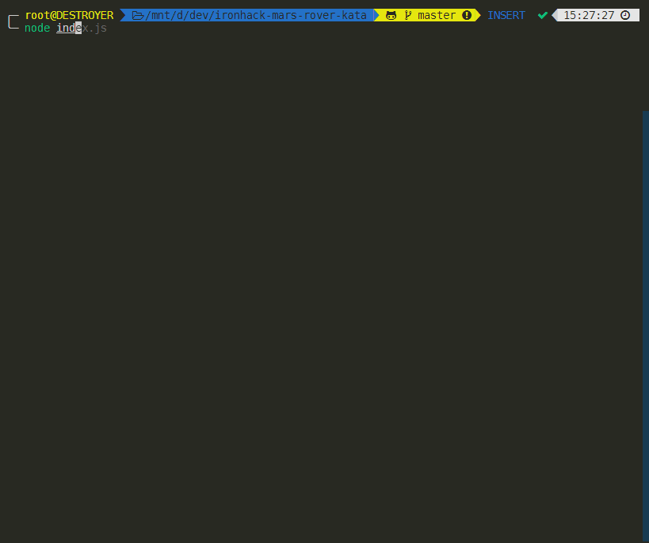

# 🚀 Ironhack Mars Rover Kata [](https://opensource.org/licenses/MIT)

A terminal-based Mars Rover Simulator written in JavaScript (Node.js).



## Instructions

The simulation will run on its own but you can press `ENTER` to force it to start, and `ESCAPE` or `CTRL` + `C` to quit the game.

## Installation

### Clone from repository and install dependencies

Just clone the repo and inside the main directory type:

```bash
git clone https://github.com/taniarascia/snek
cd ironhack-mars-rover-kata
npm install
node index.js
```

## Acknowledgements

- [Tania Rascia](https://github.com/taniarascia) I used her [Snek.js](https://github.com/taniarascia/snek/) game as a template for the ui/terminal based blessed rendering.

## Author

- [Andres Weber](https://www.github.com/andresmweber)

## License

This project is open source and available under the [MIT License](LICENSE).