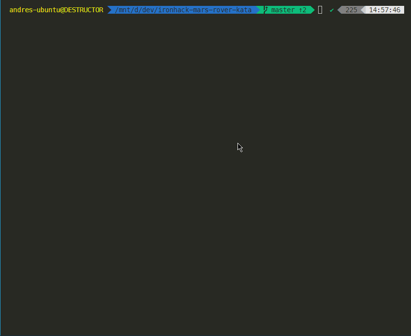

# 🚀 Ironhack Mars Rover Kata [](https://opensource.org/licenses/MIT)

A terminal-based Mars Rover Simulator written in JavaScript (Node.js).



## Instructions
### Hotkeys:
- `SPACEBAR` - This will pause the game
- `ESCAPE` or `CTRL` + `C` - This will quit the Simulation at any time.

## Installation

### Clone from repository and install dependencies

Just clone the repo and inside the main directory install it:

```bash
git clone https://github.com/andresmweber/ironhack-mars-rover-kata
cd ironhack-mars-rover-kata
npm install
```
### Run

Now you can run it with either
```bash
node index.js
```
or
```bash
npm run-script play
```
Feel free to just hit `Enter` twice and run the game in default mode (you can read the defaults on the prompts).

## Log Files

After running the simulation it will always generate a log file you can look at to see the steps and travel log in more detail.  
The filename is in the format: ```roverLog_DD-MM-YYYY_HH-MM-SS.log``` and you will find it in the directory you ran the script from.
Here is an example log file generated from the gif above:
```log
"Player Commands list:"
"    turnRight"
"    moveForward"
"    turnLeft"
"    moveBackward"
"    turnLeft"
"    moveForward"
"    turnRight"
"TURN 1    -    NUM CHARACTERS: 4"
"Starlord: Turning right!"
"Starlord: Made a turn: new direction is E with position 7,7"
"Richards: Moving backward!"
"Richards: Moving in direction 1,0 while facing N from 10,3"
"Richards: Final position is 11,3"
"Roxanne: Moving forward!"
"Roxanne: Moving in direction 1,0 while facing S from 5,10"
"Roxanne: Final position is 6,10"
"Clara: Turning right!"
"Clara: Made a turn: new direction is E with position 4,2"
"[   ] [   ] [   ] [   ] [   ] [   ] [ # ] [   ] [   ] [   ] [   ] [   ] [   ] [ # ]"
"[   ] [   ] [   ] [   ] [   ] [   ] [   ] [   ] [   ] [   ] [   ] [ # ] [   ] [   ]"
"[   ] [   ] [   ] [   ] [ ^ ] [   ] [   ] [   ] [   ] [   ] [   ] [   ] [   ] [   ]"
"[   ] [   ] [   ] [   ] [   ] [   ] [   ] [   ] [   ] [   ] [   ] [   ] [ # ] [   ]"
"[   ] [   ] [ > ] [   ] [   ] [   ] [   ] [   ] [   ] [   ] [   ] [   ] [   ] [   ]"
"[   ] [   ] [   ] [   ] [   ] [   ] [   ] [   ] [   ] [   ] [   ] [   ] [   ] [   ]"
"[   ] [   ] [   ] [   ] [   ] [   ] [ v ] [   ] [ # ] [ # ] [ v ] [   ] [   ] [   ]"
"[   ] [   ] [   ] [   ] [   ] [   ] [   ] [ > ] [   ] [   ] [   ] [   ] [   ] [   ]"
"[   ] [ # ] [   ] [   ] [   ] [   ] [   ] [   ] [   ] [   ] [   ] [   ] [   ] [   ]"
"[ # ] [   ] [   ] [   ] [   ] [   ] [   ] [   ] [   ] [   ] [   ] [   ] [   ] [   ]"
"[   ] [   ] [   ] [   ] [   ] [   ] [   ] [   ] [   ] [   ] [   ] [   ] [   ] [   ]"
"[   ] [   ] [   ] [ ^ ] [   ] [ # ] [   ] [   ] [   ] [   ] [   ] [   ] [   ] [   ]"
"[   ] [   ] [   ] [   ] [   ] [   ] [   ] [   ] [   ] [   ] [   ] [   ] [   ] [   ]"
"[   ] [   ] [   ] [   ] [   ] [   ] [ ^ ] [   ] [   ] [   ] [   ] [   ] [   ] [   ]"
"------------------------------------------------------------------------------------"
"TURN 2    -    NUM CHARACTERS: 4"
"Starlord: Moving forward!"
"Starlord: Moving in direction 0,1 while facing E from 7,7"
"Starlord: Final position is 7,8"
"Richards: Turning right!"
"Richards: Made a turn: new direction is E with position 11,3"
"Roxanne: Turning left!"
"Roxanne: Made a turn: new direction is E with position 6,10"
"Clara: Turning left!"
"Clara: Made a turn: new direction is N with position 4,2"
"[   ] [   ] [   ] [   ] [   ] [   ] [ # ] [   ] [   ] [   ] [   ] [   ] [   ] [ # ]"
"[   ] [   ] [   ] [   ] [   ] [   ] [   ] [   ] [   ] [   ] [   ] [ # ] [   ] [   ]"
"[   ] [   ] [   ] [   ] [ ^ ] [   ] [   ] [   ] [   ] [   ] [   ] [   ] [   ] [   ]"
"[   ] [   ] [   ] [   ] [   ] [   ] [   ] [   ] [   ] [   ] [   ] [   ] [ # ] [   ]"
"[   ] [   ] [ ^ ] [   ] [   ] [   ] [   ] [   ] [   ] [   ] [   ] [   ] [   ] [   ]"
"[   ] [   ] [   ] [   ] [   ] [   ] [   ] [   ] [   ] [   ] [   ] [   ] [   ] [   ]"
"[   ] [   ] [   ] [   ] [   ] [   ] [ v ] [   ] [ # ] [ # ] [ > ] [   ] [   ] [   ]"
"[   ] [   ] [   ] [   ] [   ] [   ] [   ] [   ] [ > ] [   ] [   ] [   ] [   ] [   ]"
"[   ] [ # ] [   ] [   ] [   ] [   ] [   ] [   ] [   ] [   ] [   ] [   ] [   ] [   ]"
"[ # ] [   ] [   ] [   ] [   ] [   ] [   ] [   ] [   ] [   ] [   ] [   ] [   ] [   ]"
"[   ] [   ] [   ] [   ] [   ] [   ] [   ] [   ] [   ] [   ] [   ] [   ] [   ] [   ]"
"[   ] [   ] [   ] [ > ] [   ] [ # ] [   ] [   ] [   ] [   ] [   ] [   ] [   ] [   ]"
"[   ] [   ] [   ] [   ] [   ] [   ] [   ] [   ] [   ] [   ] [   ] [   ] [   ] [   ]"
"[   ] [   ] [   ] [   ] [   ] [   ] [ ^ ] [   ] [   ] [   ] [   ] [   ] [   ] [   ]"
"------------------------------------------------------------------------------------"
"TURN 3    -    NUM CHARACTERS: 4"
"Starlord: Turning left!"
"Starlord: Made a turn: new direction is N with position 7,8"
"Richards: Turning right!"
"Richards: Made a turn: new direction is S with position 11,3"
"Roxanne: Turning right!"
"Roxanne: Made a turn: new direction is S with position 6,10"
"Clara: Moving forward!"
"Clara: Moving in direction -1,0 while facing N from 4,2"
"Clara: Final position is 3,2"
"[   ] [   ] [   ] [   ] [   ] [   ] [ # ] [   ] [   ] [   ] [   ] [   ] [   ] [ # ]"
"[   ] [   ] [   ] [   ] [   ] [   ] [   ] [   ] [   ] [   ] [   ] [ # ] [   ] [   ]"
"[   ] [   ] [   ] [   ] [ ^ ] [   ] [   ] [   ] [   ] [   ] [   ] [   ] [   ] [   ]"
"[   ] [   ] [ ^ ] [   ] [   ] [   ] [   ] [   ] [   ] [   ] [   ] [   ] [ # ] [   ]"
"[   ] [   ] [   ] [   ] [   ] [   ] [   ] [   ] [   ] [   ] [   ] [   ] [   ] [   ]"
"[   ] [   ] [   ] [   ] [   ] [   ] [   ] [   ] [   ] [   ] [   ] [   ] [   ] [   ]"
"[   ] [   ] [   ] [   ] [   ] [   ] [ v ] [   ] [ # ] [ # ] [ v ] [   ] [   ] [   ]"
"[   ] [   ] [   ] [   ] [   ] [   ] [   ] [   ] [ ^ ] [   ] [   ] [   ] [   ] [   ]"
"[   ] [ # ] [   ] [   ] [   ] [   ] [   ] [   ] [   ] [   ] [   ] [   ] [   ] [   ]"
"[ # ] [   ] [   ] [   ] [   ] [   ] [   ] [   ] [   ] [   ] [   ] [   ] [   ] [   ]"
"[   ] [   ] [   ] [   ] [   ] [   ] [   ] [   ] [   ] [   ] [   ] [   ] [   ] [   ]"
"[   ] [   ] [   ] [ v ] [   ] [ # ] [   ] [   ] [   ] [   ] [   ] [   ] [   ] [   ]"
"[   ] [   ] [   ] [   ] [   ] [   ] [   ] [   ] [   ] [   ] [   ] [   ] [   ] [   ]"
"[   ] [   ] [   ] [   ] [   ] [   ] [ ^ ] [   ] [   ] [   ] [   ] [   ] [   ] [   ]"
"------------------------------------------------------------------------------------"
"TURN 4    -    NUM CHARACTERS: 4"
"Starlord: Moving backward!"
"Starlord: Moving in direction 1,0 while facing N from 7,8"
"Starlord: Final position is 8,8"
"Richards: Turning right!"
"Richards: Made a turn: new direction is W with position 11,3"
"Roxanne: Moving forward!"
"Roxanne: Moving in direction 1,0 while facing S from 6,10"
"Roxanne: Final position is 7,10"
"Clara: Turning left!"
"Clara: Made a turn: new direction is W with position 3,2"
"[   ] [   ] [   ] [   ] [   ] [   ] [ # ] [   ] [   ] [   ] [   ] [   ] [   ] [ # ]"
"[   ] [   ] [   ] [   ] [   ] [   ] [   ] [   ] [   ] [   ] [   ] [ # ] [   ] [   ]"
"[   ] [   ] [   ] [   ] [ ^ ] [   ] [   ] [   ] [   ] [   ] [   ] [   ] [   ] [   ]"
"[   ] [   ] [ < ] [   ] [   ] [   ] [   ] [   ] [   ] [   ] [   ] [   ] [ # ] [   ]"
"[   ] [   ] [   ] [   ] [   ] [   ] [   ] [   ] [   ] [   ] [   ] [   ] [   ] [   ]"
"[   ] [   ] [   ] [   ] [   ] [   ] [   ] [   ] [   ] [   ] [   ] [   ] [   ] [   ]"
"[   ] [   ] [   ] [   ] [   ] [   ] [ v ] [   ] [ # ] [ # ] [   ] [   ] [   ] [   ]"
"[   ] [   ] [   ] [   ] [   ] [   ] [   ] [   ] [   ] [   ] [ v ] [   ] [   ] [   ]"
"[   ] [ # ] [   ] [   ] [   ] [   ] [   ] [   ] [ ^ ] [   ] [   ] [   ] [   ] [   ]"
"[ # ] [   ] [   ] [   ] [   ] [   ] [   ] [   ] [   ] [   ] [   ] [   ] [   ] [   ]"
"[   ] [   ] [   ] [   ] [   ] [   ] [   ] [   ] [   ] [   ] [   ] [   ] [   ] [   ]"
"[   ] [   ] [   ] [ < ] [   ] [ # ] [   ] [   ] [   ] [   ] [   ] [   ] [   ] [   ]"
"[   ] [   ] [   ] [   ] [   ] [   ] [   ] [   ] [   ] [   ] [   ] [   ] [   ] [   ]"
"[   ] [   ] [   ] [   ] [   ] [   ] [ ^ ] [   ] [   ] [   ] [   ] [   ] [   ] [   ]"
"------------------------------------------------------------------------------------"
"TURN 5    -    NUM CHARACTERS: 4"
"Starlord: Turning left!"
"Starlord: Made a turn: new direction is W with position 8,8"
"Richards: Turning right!"
"Richards: Made a turn: new direction is N with position 11,3"
"Roxanne: Moving forward!"
"Roxanne: Moving in direction 1,0 while facing S from 7,10"
"Roxanne: Final position is 8,10"
"Clara: Moving backward!"
"Clara: Moving in direction 0,1 while facing W from 3,2"
"Clara: Final position is 3,3"
"[   ] [   ] [   ] [   ] [   ] [   ] [ # ] [   ] [   ] [   ] [   ] [   ] [   ] [ # ]"
"[   ] [   ] [   ] [   ] [   ] [   ] [   ] [   ] [   ] [   ] [   ] [ # ] [   ] [   ]"
"[   ] [   ] [   ] [   ] [ ^ ] [   ] [   ] [   ] [   ] [   ] [   ] [   ] [   ] [   ]"
"[   ] [   ] [   ] [ < ] [   ] [   ] [   ] [   ] [   ] [   ] [   ] [   ] [ # ] [   ]"
"[   ] [   ] [   ] [   ] [   ] [   ] [   ] [   ] [   ] [   ] [   ] [   ] [   ] [   ]"
"[   ] [   ] [   ] [   ] [   ] [   ] [   ] [   ] [   ] [   ] [   ] [   ] [   ] [   ]"
"[   ] [   ] [   ] [   ] [   ] [   ] [ v ] [   ] [ # ] [ # ] [   ] [   ] [   ] [   ]"
"[   ] [   ] [   ] [   ] [   ] [   ] [   ] [   ] [   ] [   ] [   ] [   ] [   ] [   ]"
"[   ] [ # ] [   ] [   ] [   ] [   ] [   ] [   ] [ < ] [   ] [ v ] [   ] [   ] [   ]"
"[ # ] [   ] [   ] [   ] [   ] [   ] [   ] [   ] [   ] [   ] [   ] [   ] [   ] [   ]"
"[   ] [   ] [   ] [   ] [   ] [   ] [   ] [   ] [   ] [   ] [   ] [   ] [   ] [   ]"
"[   ] [   ] [   ] [ ^ ] [   ] [ # ] [   ] [   ] [   ] [   ] [   ] [   ] [   ] [   ]"
"[   ] [   ] [   ] [   ] [   ] [   ] [   ] [   ] [   ] [   ] [   ] [   ] [   ] [   ]"
"[   ] [   ] [   ] [   ] [   ] [   ] [ ^ ] [   ] [   ] [   ] [   ] [   ] [   ] [   ]"
"------------------------------------------------------------------------------------"
"TURN 6    -    NUM CHARACTERS: 4"
"Starlord: Moving forward!"
"Starlord: Moving in direction 0,-1 while facing W from 8,8"
"Starlord: Final position is 8,7"
"Richards: Moving backward!"
"Richards: Moving in direction 1,0 while facing N from 11,3"
"Richards: Final position is 12,3"
"Roxanne: Moving forward!"
"Roxanne: Moving in direction 1,0 while facing S from 8,10"
"Roxanne: Final position is 9,10"
"Clara: Moving backward!"
"Clara: Moving in direction 0,1 while facing W from 3,3"
"Clara: Final position is 3,4"
"[   ] [   ] [   ] [   ] [   ] [   ] [ # ] [   ] [   ] [   ] [   ] [   ] [   ] [ # ]"
"[   ] [   ] [   ] [   ] [   ] [   ] [   ] [   ] [   ] [   ] [   ] [ # ] [   ] [   ]"
"[   ] [   ] [   ] [   ] [ ^ ] [   ] [   ] [   ] [   ] [   ] [   ] [   ] [   ] [   ]"
"[   ] [   ] [   ] [   ] [ < ] [   ] [   ] [   ] [   ] [   ] [   ] [   ] [ # ] [   ]"
"[   ] [   ] [   ] [   ] [   ] [   ] [   ] [   ] [   ] [   ] [   ] [   ] [   ] [   ]"
"[   ] [   ] [   ] [   ] [   ] [   ] [   ] [   ] [   ] [   ] [   ] [   ] [   ] [   ]"
"[   ] [   ] [   ] [   ] [   ] [   ] [ v ] [   ] [ # ] [ # ] [   ] [   ] [   ] [   ]"
"[   ] [   ] [   ] [   ] [   ] [   ] [   ] [   ] [   ] [   ] [   ] [   ] [   ] [   ]"
"[   ] [ # ] [   ] [   ] [   ] [   ] [   ] [ < ] [   ] [   ] [   ] [   ] [   ] [   ]"
"[ # ] [   ] [   ] [   ] [   ] [   ] [   ] [   ] [   ] [   ] [ v ] [   ] [   ] [   ]"
"[   ] [   ] [   ] [   ] [   ] [   ] [   ] [   ] [   ] [   ] [   ] [   ] [   ] [   ]"
"[   ] [   ] [   ] [   ] [   ] [ # ] [   ] [   ] [   ] [   ] [   ] [   ] [   ] [   ]"
"[   ] [   ] [   ] [ ^ ] [   ] [   ] [   ] [   ] [   ] [   ] [   ] [   ] [   ] [   ]"
"[   ] [   ] [   ] [   ] [   ] [   ] [ ^ ] [   ] [   ] [   ] [   ] [   ] [   ] [   ]"
"------------------------------------------------------------------------------------"
"TURN 7    -    NUM CHARACTERS: 4"
"Starlord: Turning right!"
"Starlord: Made a turn: new direction is N with position 8,7"
"Richards: Moving backward!"
"Richards: Moving in direction 1,0 while facing N from 12,3"
"Richards: Final position is 13,3"
"Roxanne: Moving forward!"
"Roxanne: Moving in direction 1,0 while facing S from 9,10"
"Roxanne: Final position is 10,10"
"Clara: Moving forward!"
"Clara: Moving in direction 0,-1 while facing W from 3,4"
"Clara: Final position is 3,3"
"[   ] [   ] [   ] [   ] [   ] [   ] [ # ] [   ] [   ] [   ] [   ] [   ] [   ] [ # ]"
"[   ] [   ] [   ] [   ] [   ] [   ] [   ] [   ] [   ] [   ] [   ] [ # ] [   ] [   ]"
"[   ] [   ] [   ] [   ] [ ^ ] [   ] [   ] [   ] [   ] [   ] [   ] [   ] [   ] [   ]"
"[   ] [   ] [   ] [ < ] [   ] [   ] [   ] [   ] [   ] [   ] [   ] [   ] [ # ] [   ]"
"[   ] [   ] [   ] [   ] [   ] [   ] [   ] [   ] [   ] [   ] [   ] [   ] [   ] [   ]"
"[   ] [   ] [   ] [   ] [   ] [   ] [   ] [   ] [   ] [   ] [   ] [   ] [   ] [   ]"
"[   ] [   ] [   ] [   ] [   ] [   ] [ v ] [   ] [ # ] [ # ] [   ] [   ] [   ] [   ]"
"[   ] [   ] [   ] [   ] [   ] [   ] [   ] [   ] [   ] [   ] [   ] [   ] [   ] [   ]"
"[   ] [ # ] [   ] [   ] [   ] [   ] [   ] [ ^ ] [   ] [   ] [   ] [   ] [   ] [   ]"
"[ # ] [   ] [   ] [   ] [   ] [   ] [   ] [   ] [   ] [   ] [   ] [   ] [   ] [   ]"
"[   ] [   ] [   ] [   ] [   ] [   ] [   ] [   ] [   ] [   ] [ v ] [   ] [   ] [   ]"
"[   ] [   ] [   ] [   ] [   ] [ # ] [   ] [   ] [   ] [   ] [   ] [   ] [   ] [   ]"
"[   ] [   ] [   ] [   ] [   ] [   ] [   ] [   ] [   ] [   ] [   ] [   ] [   ] [   ]"
"[   ] [   ] [   ] [ ^ ] [   ] [   ] [ ^ ] [   ] [   ] [   ] [   ] [   ] [   ] [   ]"
"------------------------------------------------------------------------------------"
"TRAVEL MAP FOR ALL ROVERS:"
"[   ] [   ] [   ] [   ] [   ] [   ] [   ] [   ] [   ] [   ] [   ] [   ] [   ] [   ]"
"[   ] [   ] [   ] [   ] [   ] [   ] [   ] [   ] [   ] [   ] [   ] [   ] [   ] [   ]"
"[   ] [   ] [   ] [   ] [   ] [   ] [   ] [   ] [   ] [   ] [   ] [   ] [   ] [   ]"
"[   ] [   ] [ C ] [ C ] [ C ] [   ] [   ] [   ] [   ] [   ] [   ] [   ] [   ] [   ]"
"[   ] [   ] [ C ] [   ] [   ] [   ] [   ] [   ] [   ] [   ] [   ] [   ] [   ] [   ]"
"[   ] [   ] [   ] [   ] [   ] [   ] [   ] [   ] [   ] [   ] [ R ] [   ] [   ] [   ]"
"[   ] [   ] [   ] [   ] [   ] [   ] [   ] [   ] [   ] [   ] [ R ] [   ] [   ] [   ]"
"[   ] [   ] [   ] [   ] [   ] [   ] [   ] [ S ] [ S ] [   ] [ R ] [   ] [   ] [   ]"
"[   ] [   ] [   ] [   ] [   ] [   ] [   ] [ S ] [ S ] [   ] [ R ] [   ] [   ] [   ]"
"[   ] [   ] [   ] [   ] [   ] [   ] [   ] [   ] [   ] [   ] [ R ] [   ] [   ] [   ]"
"[   ] [   ] [   ] [ R ] [   ] [   ] [   ] [   ] [   ] [   ] [ R ] [   ] [   ] [   ]"
"[   ] [   ] [   ] [ R ] [   ] [   ] [   ] [   ] [   ] [   ] [   ] [   ] [   ] [   ]"
"[   ] [   ] [   ] [ R ] [   ] [   ] [   ] [   ] [   ] [   ] [   ] [   ] [   ] [   ]"
"[   ] [   ] [   ] [ R ] [   ] [   ] [   ] [   ] [   ] [   ] [   ] [   ] [   ] [   ]"

```
Notice the travel map at the end which shows you the path they've taken.  Note that it will not show you if the rover has been over a spot multiple times, just shows the path with overlaps.

## Acknowledgements
- [Tania Rascia](https://github.com/taniarascia) I used her [Snek.js](https://github.com/taniarascia/snek/) game as a template for the ui/terminal based blessed rendering.

## Author
- [Andres Weber](https://www.github.com/andresmweber)

## Sprites
- [Andres Weber](https://www.piskelapp.com/user/5716277421670400/public)
  
## License
This project is open source and available under the [MIT License](LICENSE).