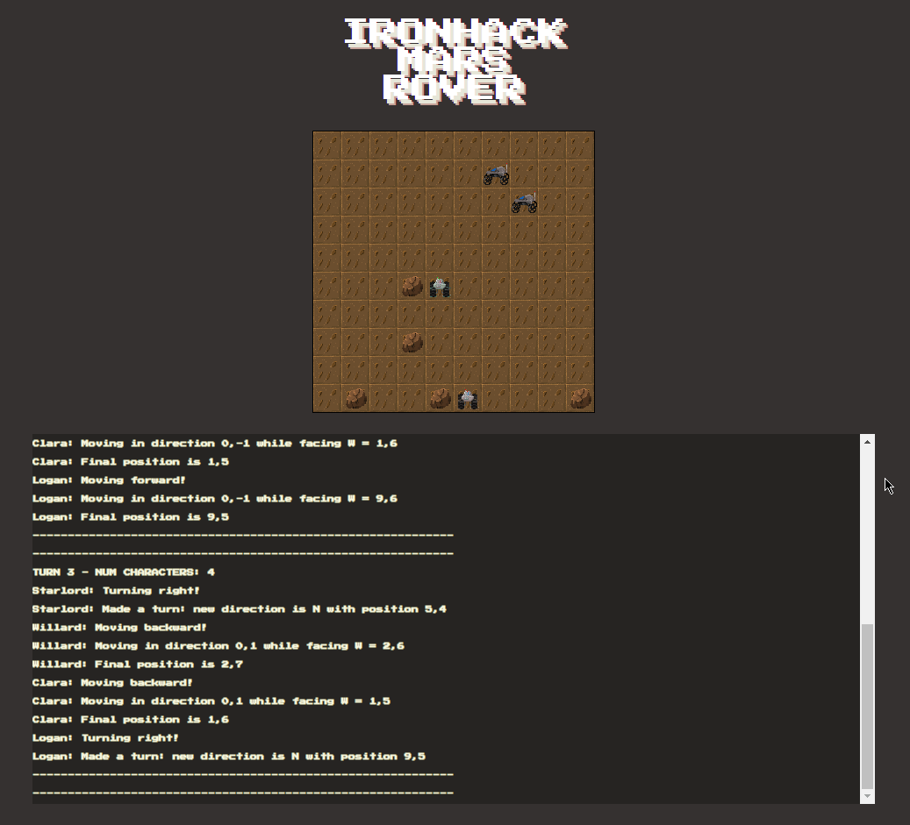

# 🌌🚀🤖☄️🌑🌌 Ironhack Mars Rover Kata [](https://opensource.org/licenses/MIT)

A terminal-based Mars Rover Simulator written in JavaScript (Node.js).



## Instructions
### Hotkeys:
- `SPACEBAR` - This will pause the game
- `ESCAPE` or `CTRL` + `C` - This will quit the Simulation at any time.

## Installation

### Clone from repository and install dependencies

Just clone the repo and inside the main directory install it:

```bash
git clone https://github.com/andresmweber/ironhack-mars-rover-kata
cd ironhack-mars-rover-kata
npm install
```
### Run

Now you can run it with either
```bash
node index.js
```
or
```bash
npm run-script play
```
Feel free to just hit `Enter` twice and run the game in default mode (you can read the defaults on the prompts).

## Log Files

After running the simulation it will always generate a log file you can look at to see the steps and travel log in more detail.  
The filename is in the format: ```roverLog_DD-MM-YYYY_HH-MM-SS.log``` and you will find it in the directory you ran the script from.
Here is an [example log file]() generated from the gif above.


Notice the travel map at the end which shows you the path they've taken.  Note that it will not show you if the rover has been over a spot multiple times, just shows the path with overlaps.

## Acknowledgements
- [Tania Rascia](https://github.com/taniarascia) I used her [Snek.js](https://github.com/taniarascia/snek/) game as a template for the ui/terminal based blessed rendering.

## Author
- [Andres Weber](https://www.github.com/andresmweber)

## Sprites
- [Andres Weber](https://www.piskelapp.com/user/5716277421670400/public)
  
## License
This project is open source and available under the [MIT License](LICENSE).
